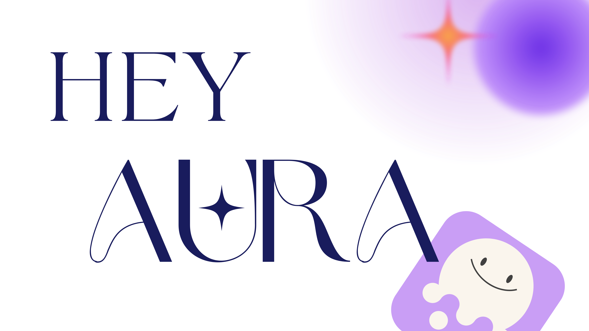

<div align="center">
  
  
  ### 声即命令、文即思想
  
  <p align="center">
    <b>タイピング不要、音声だけ。完全ローカル実行、プライバシー保護。</b>
  </p>
  
  <p align="center">
    <a href="README.md"> English</a> | <a href="../README.md"> 中文</a> | <a href="README_ja.md"> 日本語</a>
  </p>
</div>


## 🚀 3つのシーンで働き方を変革

| 📹 **会議をスマートに** | 🎙️ **話すように書く** | 🤖 **音声でPC操作** |
|---|---|---|
| リアルタイム転写 + AI要約で、記録ではなく対話に集中 | あらゆる入力ボックスで音声入力。メール、文書、コード注釈まで | 「プロジェクトを開いて」「資料を検索」「コードをデバッグ」- 話すだけで実行 |
|  |  |  |

## ⚡ 核心優勢

**3倍速**音声入力効率 | **<0.5秒**認識遅延 | **100%**ローカルプライバシー | **$0**使用コスト

| 機能 | Hey Aura | クラウドサービス |
|---------|----------|-----------------|
| **応答速度** | ⚡️ < 0.5秒 | 🐢 > 1秒 |
| **認識精度** | 🎯 Whisper/Parakeet ➕ ホットワード認識 | 😬 汎用モデル |
| **拡張性** | 🌬️ 自由にカスタマイズ | 😬 機能制限あり |
| **コマンドシステム** | ✨ PC操作可能 | 😬 基本テキスト操作のみ |
| **プライバシー保護** | 🔒 完全ローカル | 🤔 音声アップロード |
| **使用コスト** | 🆓 $0 | 💰 月額 $10+ |

<details>
<summary><b>Hey Auraが高速で高精度な理由</b> 🚀</summary>

### 1. 🎤 プロフェッショナル音声前処理
- **Silero VAD**：リアルタイム音声活動検出、音声セグメントを精密抽出、無効な無音処理を回避
- **音声ノイズ除去**：適応スペクトル減算法によるノイズ除去、背景ノイズ除去で認識精度向上
- **動的ゲイン**：LUFS標準ラウドネス正規化で音質の一貫性を確保

### 2. ⚡ ハードウェア加速最適化
- **Windows CUDA**：NVIDIA GPU並列計算活用で推論速度10倍向上
- **macOS MLX**：Apple Silicon専用最適化、Mシリーズチップ性能を最大活用
- **モデル量子化**：INT8/FP16精度最適化でメモリ使用量50%削減、速度2倍向上

### 3. 🎯 最適化されたモデル選択
- **シーン適応**：言語環境に適したモデル設定で高精度実現
- **英語専用**：Parakeetモデルで幻覚なし、最高精度
- **多言語**：Whisper Turboまたはコミュニティ微調整版で特化最適化

### 4. 🧠 エージェントベースホットワード智能補正
- **音標マッチング**：単純テキスト置換でなく音標類似度ベースで発音意図を理解
- **文脈認識**：意味情報と組み合わせて智能判断、固有名詞を正確認識
- **リアルタイム修正**：後処理でASR幻覚を補正、吃音や間投詞を除去

> これら4つの技術の組み合わせで、Hey Auraはミリ秒レベルの応答とプロ級精度を実現

</details>

## クイックスタート

### 前提条件

<details>
<summary><b>🪟 Windows GPUユーザー</b>（CUDA インストール必要）</summary>

1. [CUDA Toolkit 12.6](https://developer.download.nvidia.com/compute/cuda/12.6.0/local_installers/cuda_12.6.0_560.76_windows.exe) と [CUDNN 9.3.0](https://developer.download.nvidia.com/compute/cudnn/9.3.0/local_installers/cudnn_9.3.0_windows.exe) をダウンロード・インストール
2. `C:\Program Files\NVIDIA\CUDNN\v9.3\bin\12.6` をシステムPATHに追加し**コンピュータを再起動**

</details>

<details>
<summary><b>🍎 macOSユーザー</b>（システム権限設定必要）</summary>

1. **システム環境設定** → **セキュリティとプライバシー**を開く
2. **アクセシビリティ**と**入力監視**にターミナルを追加
3. 許可後、ターミナルを再起動
4. （オプション）会議モードでシステム音声録音が必要な場合：**[Blackhole設定ガイドを参照 →](macos-audio-setup.md)**

</details>

### ⚡ 方法1：環境パッケージ 1分で開始

#### プラットフォームを選択

[](https://drive.google.com/file/d/1i2tCK6BOYSmDTzqpkAMd1FZfaW6OqKmk/view?usp=sharing)
[](https://drive.google.com/file/d/14MKmDtPMVtF5ChhwZeoU4WR7y-PAYBOq/view?usp=sharing)
[](https://drive.google.com/file/d/1mGDtMkWfbJA6VWJaJpg-TwP4FvaPFBds/view?usp=sharing)

#### ダウンロード使用方法

**準備作業：**
1. プロジェクトコードをダウンロード
2. 対応プラットフォームの環境パッケージをダウンロード

**Windows ユーザー：**
1. ダウンロードした zip ファイルを解凍
2. 解凍した `python_env` フォルダをプロジェクトルートディレクトリに配置
3. `Start_Windows.bat` をダブルクリックで実行

**macOS ユーザー：**
1. ダウンロードした *.tar.gz 環境パッケージをプロジェクトルートディレクトリに配置
2. 初回実行時は実行権限を付与：
   - ターミナルを開き、`cd` コマンドで hey-aura ディレクトリに移動
   - `chmod +x Start_MacOS.command` を実行
3. `Start_MacOS.command` をダブルクリックで実行
   - ダブルクリックで実行できない場合は、ターミナルで `./Start_MacOS.command` を実行

> 初回実行は環境読み込みに時間がかかります。1分程度お待ちください。ASRモデルは起動時に自動ダウンロードされます。

### 方法2：ソースコードインストール

```bash
# 1. 環境準備
conda create -n hey-aura python=3.10
conda activate hey-aura

# 2. Windows GPUユーザーは事前にCuda版PyTorchをインストール
# pip install torch torchvision torchaudio --index-url https://download.pytorch.org/whl/cu118
# Windows CPUとMacユーザーは無視可能、次のステップで自動インストールされます

# 3. クローンとインストール
git clone https://github.com/Huanshere/hey-aura.git
cd hey-aura
pip install -e .

# 4. （オプション）追加ASRバックエンド（faster-whisper/mlx-whisperは標準インストール済み）
# pip install funasr             # zh と en、低リソース
# pip install parakeet-mlx       # MacOS parakeet 英語のみ

## Windows版nemo parakeetのインストールは複雑です ⬇️
# set PYTHONUTF8=1
# set PYTHONIOENCODING=utf-8
# chcp 65001 >NUL
# python -m pip install "nemo_toolkit[asr]"
# pip install cuda-python==12.3

# 5. アプリケーション起動
# Macユーザーは上記のプライバシーとセキュリティ権限にIDEを追加してください
python app.py
```

## 🎯 Hey Aura 使用開始

### 👋 初回使用？これを試してください：

1. メモ帳や任意のテキストエディタを開く
2. **Fnキー（Mac）** または **Ctrl+Win（Windows）** を押し続ける
3. 「Hey Aura は本当に素晴らしいです」と話す
4. キーを離す

文字が表示されましたか？🎉 使い方を覚えました！

---

## 核心機能

<details>
<summary><b>📹 会議モード</b> - 自動録音、リアルタイム転写、AI要約で会議自体に集中。</summary>

### 使用方法

**トレイを右クリック** → **録音開始** → **録音終了** → **AI要約**

- **トリガー**：システムトレイ右クリックメニュー
- **機能**：マイクとシステム音声を同時録音
- **出力**：
  - 音声ファイル（MP3）
  - リアルタイム転写テキスト
  - AI智能要約
- **保存場所**：`recordings/meetings/` ディレクトリ

### macOS システム音声録音設定

システム音声録音にはBlackHole仮想音声デバイスの設定が必要

👉 [**詳細設定ガイドを参照**](macos-audio-setup.md)

### 出力ファイル

会議録音完了後、`recordings/meetings/` ディレクトリに生成：

1. **音声ファイル** - `meeting_YYYYMMDD_HHMMSS.mp3`
2. **転写テキスト** - `meeting_YYYYMMDD_HHMMSS.txt`
3. **AI要約** - 転写テキストファイルに含まれる

### 使用シーン

- 重要会議記録
- オンライン授業録画
- インタビュー録音
- 音声記録と転写が必要な全シーン

</details>

<details>
<summary><b>🎙️ 書き取りモード</b> - 音声をリアルタイムでテキストに変換、あらゆる入力ボックスに対応。エージェントベースホットワード技術で固有名詞認識精度が従来方式を大幅に上回る。</summary>

### 🎯 核心特徴

**押して話す、離して転写**
- ショートカットキー（Windows: Ctrl+Win / macOS: Fn）を押し続けて音声入力開始
- 自然に話す、長文・休止・思考をサポート
- キーを離すと自動的に転写完了し、現在のカーソル位置に貼り付け

### 🚀 智能ホットワード機能

Hey Auraは革新的な**エージェントベースホットワード補正**を採用し、現在最も正確な音声認識最適化技術です。

**動作原理：**
- 📝 **音標智能マッチング**：音標類似度に基づく智能マッチング、単純テキスト置換でなく実際の発話意図を理解
- 🧠 **意味文脈分析**：文脈情報と組み合わせて智能判断、認識結果を補正
- 🎯 **固有名詞精密認識**：技術用語、ブランド名、人名等の固有名詞認識精度が従来方式を大幅に上回る
- ✨ **智能最適化処理**：吃音、間投詞（ええ、あの、えーっと等）を自動除去、テキストをより流暢で専門的に

**使用例：**

あなたが「Claude Codeでこのコードをリファクタリングしたい、ええっと、あのAnthropicのツールです」と話した時：

- **従来ASR出力**：cloud codeでこのコードをリファクタリングしたいええっとあのand topicのツールです
- **Hey Aura出力**：Claude Codeでこのコードをリファクタリングしたい、あのAnthropicのツールです

### 📋 ホットワード設定

`config.yaml`で常用固有名詞を設定：

```yaml
dictation_rewrite:
  enabled: true  # 智能書き換え有効
  hotwords:      # 固有名詞を追加
    - Claude Code
    - Anthropic
    - ChatGPT
    - OpenAI
```

### ショートカットキー

- **macOS**: `Fn` キー
- **Windows**: `Ctrl+Win` キー

### 使用シーン

- メール作成、コード注釈、チャットメッセージ
- テキスト入力が必要な全シーン
- 長文書作成時の音声入力

</details>

<details>
<summary><b>🤖 コマンドモード</b> - 音声でPC操作：アプリ起動、資料検索、自動化実行。カスタムコマンド拡張対応。</summary>

コマンドモードで音声により直接デスクトップワークフローを制御、集中力維持、効率向上。

### ショートカットキー

- **macOS**: `Fn+Control` キー
- **Windows**: `Win+Alt` キー

### 核心ツール

#### 🔍 Askツール - 智能問答
**機能：** 音声質問をAIサービスに送信して問い合わせ

**使用例：**
- *「Pythonの辞書のベストプラクティスについて聞いて」*
- システムが自動でPerplexityを開いて問い合わせ送信

**設定可能サービス：** ChatGPT、Claude、Perplexity、Kimi、Deepseek

#### 💻 Cursor with Claude Code - コードアシスタント
**機能：** ローカルGitプロジェクトを認識してCursor + Claude Code統合

**核心能力：**

1. **Cursorでプロジェクトを開く**
   - 設定ディレクトリのGitプロジェクトを自動スキャン
   - 音声コマンド：*「hey-auraを開いて」*

2. **Claude Code実行**
   - 音声コマンド：*「Readmeを更新して」*
   - CursorでClaude Codeを直接呼び出して修正実行

3. **ワークフロー統合**
   - 音声コマンド：*「hey-auraを開いて設定ファイルを修正して」*
   - Cursorで自動オープン + Claude Code実行

**macOS設定：**
1. CursorでClaude Codeプラグインをインストール、右上CCアイコンを右クリック - キーバインド設定
2. Claude Code起動ショートカットを `Option + C` に設定

**Windows設定：**
wslでclaude codeをインストール、後でcliの `wsl claude` で起動

#### 📧 N8N ワークフロー統合 - 自動化タスク実行
**機能：** 音声でN8Nワークフローをトリガー、複雑な自動化タスクを実現

**現存demo：Email読み取り・返信**
   - 音声コマンド：*「今日新しいメールはありますか」*
   - N8Nワークフローを自動トリガー、最近のメールを取得
   - Auraが要約してコマンドラインに出力
   
**config.yamlで設定：**
```yaml
n8n:
   username: "your_n8n_basic_credential"
   password: "your_n8n_basic_credential"
   get_emails_url: "your_n8n_webhook_url"
```

#### ✍️ カスタムツール

コマンドモードには任意のワークフローを追加可能

📖 **[カスタムツール作成方法を参照 →](custom-tools.md)**

### 使用シーン

- 「Pythonチュートリアルを検索して」
- 「hey-auraプロジェクトを開いて」  
- Cursorで「Readmeを修正して」
- PC操作、アプリ起動、タスク実行

</details>

## ⚙️ AIサービス設定

Hey AuraはコマンドをAIサービスに理解させる必要があります。

### 🎯 最速の方式（初心者推奨）

1. [groq.com](https://groq.com) にアクセス → 登録 → 無料API Key取得
2. `config.yaml` を編集：
   ```yaml
   llm:
     api_key: gsk_あなたのキー  # ← ここだけ変更
     # 他の設定はデフォルトのままで可
   ```
3. 完了！使用開始

> ✅ **Groqを選ぶ理由：** 無料 + 高速 + クレジットカード不要

### 🎤 ASR音声認識モデル

Hey Auraは標準で `whisper-large-v3-turbo` モデルを使用し、速度と精度の最適バランスを提供。

#### モデル性能比較

| モデル | シーン | Win GPU | Mac MLX | CPU | 精度 | メモリ | 言語 |
|------|------|---------|---------|-----|------|------|------|
| **Parakeet** | 英語のみ | 130ms | 150ms | 🐢 | 🤩 | 3GB | 英語のみ |
| **Whisper V3 Turbo** | 汎用推奨 | 400ms | 1.2s | 🐢 | 😊 | 1.1GB | 多言語 |
| **コミュニティ微調整Turbo** | 特定言語 | 400ms | 1.2s | 🐢 | 😊 | 1.1GB | 多言語 |
| **FunASR** | リソース制限 | 150ms | ❌ | 1.5s | 😐 | 800MB | 中国語 |
| **Whisper V3** | マイナー言語 | 600ms | 1.5s | 🐢 | 🚀 | 2.5GB | 100+ |

#### 選択推奨
- **英語のみ**：`parakeet` が最高性能・精度を提供
- **単一言語メイン**：`whisper-large-v3-turbo`（標準）またはコミュニティ微調整版
- **デバイス性能制限**： `funasr` リソース使用量最小
- **マイナー言語**：`whisper-large-v3` 最も包括的なサポート

`config.yaml`で設定：
```yaml
asr:
  # オプション: whisper-large-v3, whisper-large-v3-turbo, parakeet, funasr, hf_model_url, local_model_dir
  model: whisper-large-v3-turbo  
  language: ja  # 言語コード (ja, en, zh, auto 等)
```

📖 **[高度な設定を参照 →](advanced-config.md)** より多くのLLMオプション、ホットワード、多言語等含む


## 🗓️ 計画機能

- [ ] **起動ワード起動** - ボタン不要音声起動
- [ ] **音声出力** - TTS音声返答機能
- [ ] **Computer Use** - 自動デスクトップ操作
- [ ] **Memory モジュール** - パーソナライズド記憶システム
- [ ] **会議アシスタント** - リアルタイム問題検出・解答
- [ ] **Windows アニメーションアイコン** - クラゲアニメーション移植
- [ ] **Claude Code SDK** - コード自動化統合
- [ ] **ブラウザ制御** - StageHand統合

## ⚠️ 現在の既知制限

1. **クリップボード上書き**：書き取りモードの出力は直接クリップボードに入力され、以前のクリップボード内容を上書きします。使用前に重要なクリップボード内容を保存することを推奨

2. **ASRモデル幻覚問題**：WhisperとFunASRは極短音声で幻覚を生じる可能性があり、VADアルゴリズムで良好に制限済み。Parakeetモデルは完全に幻覚なし、英語シーン推奨

3. **Windows書き取りモードでvのみ出力**：ASR認識が速すぎることによる（笑）、書き取りモードのCtrlキーがまだ離されていないのに認識完了してCtrl+Vで貼り付けを行うため。手動でもう一度Ctrl+V貼り付けを行えば可能

4. **Mac外付けキーボードでトリガー不可**：キー配置の問題と思われ、後で修正予定

## 💭 なぜHey Auraを作ったのか

> 『Her』を見て気づいた：私たちは毎日8時間タイピングしているが、話すことが最も自然なコミュニケーション方法であることを忘れている。
> 
> AI時代にテキストボックスに困る必要はない。

Hey Auraは完璧ではありませんが、あなたが話すすべての言葉を理解しようと努力しています。

## 謝辞

https://github.com/tez3998/loopback-capture-sample Windows システム音声録音